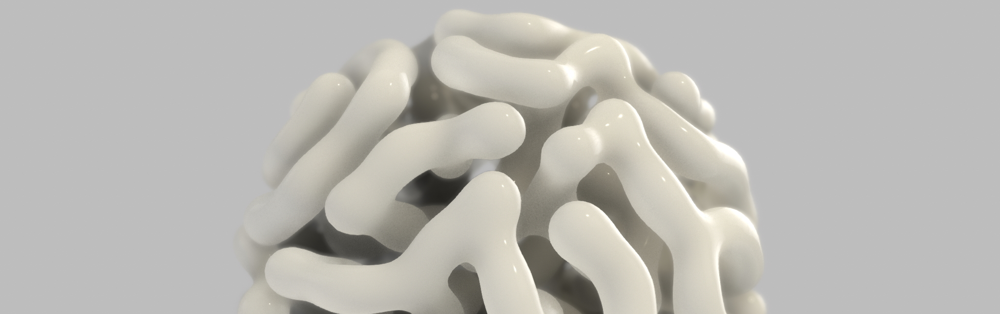

👋 Hi, I'm Andy, a Generative Designer based in Montreal, Canada.

I graduated in 2013 with a Master in Computer Science from Université Lyon II. I have a robust background in the video game industry with over 10 years of experience at compagnies like Ubisoft and EA Motive.

Since 2019, I've embarked on a freelance journey, collaborating with teams at different studios around the world. This has led me to work with a wild range of technologies like Unity, C++, GLSL, JavaScript/Typescript and p5js.

I'm always available for a quick chat, talk about projects and collaborations! Feel free to say hi at <a@andbc.co>

## Socials

For a glimpse of my personal work, check out the following links:
* [Instagram](https://www.instagram.com/andyduboc/) 
* [Twitter](https://twitter.com/andyduboc) 
* [Website](https://andbc.co/) 

<!--
**andydbc/andydbc** is a ✨ _special_ ✨ repository because its `README.md` (this file) appears on your GitHub profile.

Here are some ideas to get you started:

- 🔭 I’m currently working on ...
- 🌱 I’m currently learning ...
- 👯 I’m looking to collaborate on ...
- 🤔 I’m looking for help with ...
- 💬 Ask me about ...
- 📫 How to reach me: ...
- 😄 Pronouns: ...
- ⚡ Fun fact: ...
-->
